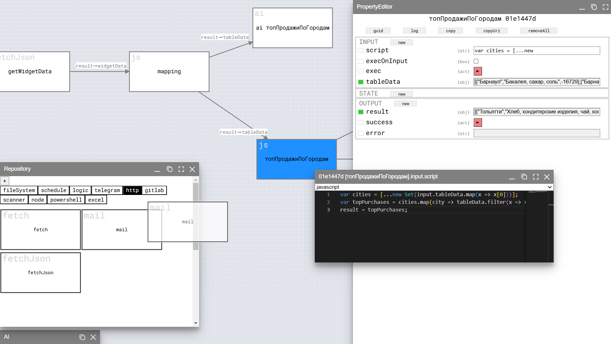

 
*Do less, get more!*

---

## installation
```docker run -d -p5000:5000 -v "$PWD:/cwd" -e TLS=true -e AUTH=true -e WEB_CWD=true tilliwilli/d3s-playground```

## usage
**todo**

## examples


## documentations
[Wiki](https://github.com/thetilliwilli/d3s-preview/wiki)